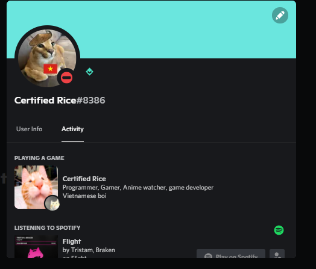

# Discord RPC
Discord RPC status made for @Certified_Rice



# run
```js
npm install
node .
```

# changing the discord-rpc title
First go to [Discord Developer Portal](https://discord.com/developers/applications), then create a new application. 

Copy and Application id then paste it into `clientId: "949827465746980864` in [index.js](https://github.com/CertifiedRice/discord-rpc/blob/main/index.js), [line 25](https://github.com/CertifiedRice/discord-rpc/blob/main/index.js#L25)

#

**You can edit the status to your wish!**